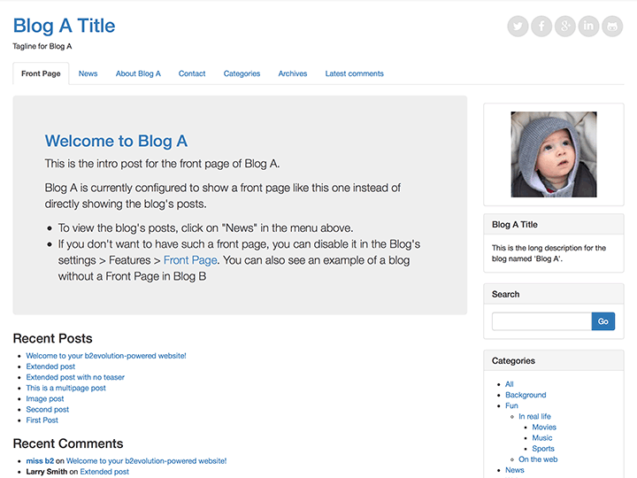
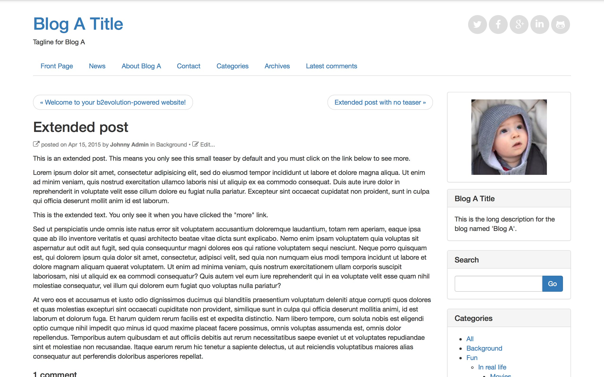

## Bootstrap Blog skin for b2evolution CMS.

This responsive skin uses the twitter bootstrap framework. When the viewport is too narrow, the sidebar goes under the main area. 
This skin is included in b2evolution 5.1.1, and only supported starting from that version.
   
  
### Front page
  
### Front page
  
### Posts page
  
### Single page

### Update Log:

#### v6.7.8-stable
-sync with latest bootstrap_blog_skin built-in version in b2evolution 6.7.8-stable

#### v6.7.6-stable
- Implemented LESS modules for different widget layouts
- Additional small skin fixes
